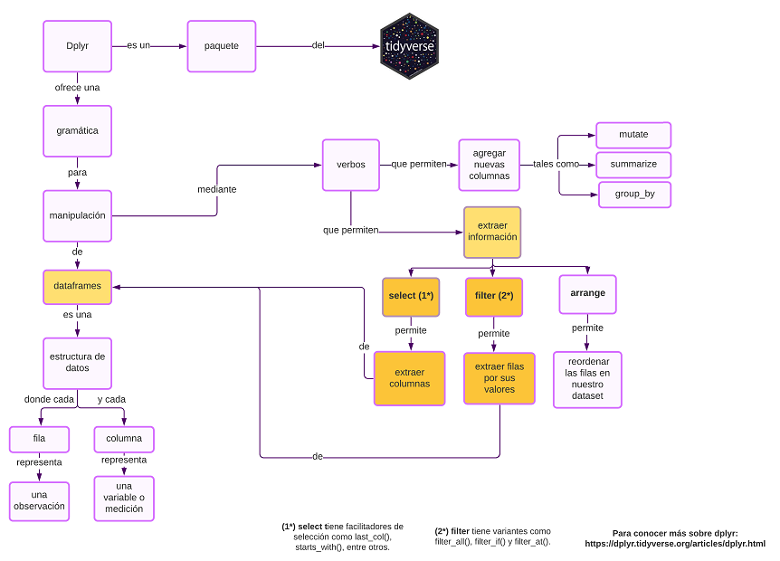

# Clase para la certificación de Rstudio

# Contenido:

## Learner Persona

* Una learner persona para caracterizar a una persona tipo destinataria de la presente lección.

## Mapa Conceptual

* Un mapa conceptual sobre el contenido de la lección, el cual servirá de guía al estudiante.

## Material que se usará durante la lección.
**Slides**
**Código**

## Ejercicios para la Evaluación formativa
* Ejercicios del tipo pregunta de **opción múltiple** y **fill in the blanks**.

### Learner Persona 🙎‍♂️ 🙎‍♀️

En la siguiente descripción se detalla el contexto, experiencia relevante, necesidades y consideraciones especiales del estudiante para cual está pensada la presente lección.

Andrea, tiene 33 años, es colombiana y hace algunos años vive en Argentina, es estudiante avanzada de Sociología de la UBA, y actualmente está en la búsqueda de material para el desarrollo de su tesis en el que analizará la participación de las mujeres en la política argentina desde 1947, año en que se promulgó la ley de sufragio femenino en el país, hasta la actualidad, y el cual es el último requisito para obtener su título de grado. Andrea, es una persona usuaria de Excel y hasta el momento le fue de utilidad para cargar datos y procesarlos pero en este período se dio cuenta que para el desarrollo de su tesis necesitará una herramienta más versátil que excel, que le permita procesar mayor cantidad de datos en menos tiempo. Además, algunas compañeras que ingresaron a trabajar como investigadoras, le recomendaron aprender R para manipular los datos de su tesis de manera ordenada y reproducible y le comentaron que le será de utilidad en cada etapa de su investigación (lectura, limpieza, procesamiento, visualización y comunicación de sus datos). Como es proactiva, Andrea ya está en la búsqueda de un curso introductorio que le permita aprender las habilidades principales del análisis de datos en un tiempo corto. Además de estudiar trabaja a tiempo completo, por lo que no dispone de mucho tiempo libre. El horario de cursado  será un factor decisivo a la hora de seleccionar un curso. 

 
## Sobre la clase de hoy 👩‍🏫

Esta lección es parte de un curso cuatrimestral para estudiantes de Ciencias Sociales denominado **Primeros pasos en R para personas de Ciencias Sociales**. El curso incluye las habilidades necesarias para llevar adelante un proyecto de análisis de datos: lectura y limpieza, manipulación, visualización y comunicación de datos.

Esta breve lección de 15 minutos es parte del módulo **Herramientas útiles para manipular datos con el paquete dplyr**. 

Los estudiantes han visto en las clases anteriores manejo de la consola, vectores y operaciones, lectura de datos, el operador pipe, la función view, entre otros . 

## [Mapa conceptual](https://github.com/PatriLoto/rstudio_certification2020/blob/master/img/mapa_conceptual_4.png) 🗺️



## Material de la clase 🗂
 * **[Slides](https://github.com/PatriLoto/rstudio_certification2020/blob/master/presentacion_herramientas_utiles_para_manipulacion_datos.html)**
 * **[Código](https://github.com/PatriLoto/rstudio_certification2020/blob/master/leccion_dplyR_01.R)** 
 * **[Proyecto de Rstudio cloud](https://rstudio.cloud/project/1782608)**


### Librerias necesarias 
* Tidyverse
* Guaguas

``` r
# 1. Instalación de las librerías
install.packages("tidyverse")
devtools::install_github("rivaquiroga/guaguas")

# 2. Carga de las librerías
library(tidyverse)
library(guaguas)

```

## Evaluación formativa
#### Ejercicio 1
``` r
¿Con cuál opción seleccionamos todas las variables de guaguas excepto el sexo y cantidad de ocurrencia de cada nombre?
 Opciones:

a. guaguas %>% select(sexo, n)

b. guaguas %>% select(!c(sexo, n))   CORRECTA

c. guaguas %>% select(guaguas, anio, nombre, proporcion)
 
```

#### Solución 1

``` r
b- guaguas %>% select(!c(sexo, n))   CORRECTA
```

#### Ejercicio 2 

```r
## En Chile un nombre muy popular es Salvador por Salvador Allende ¿Con cuál opción filtramos aquellas filas que contengan el nombre Salvador a partir del año de su fallecimiento (1973)?
## Opciones: 
  
a. guaguas %>% filter (name = "Salvador", anio >=1973)  
  
b. guaguas %>% filter (anio >= 1973 & nombre == "Salvador")   CORRECTA

c. guaguas %>% filter (nombre == "Salvador", anio == 1973)
  
```

#### Solución 2

```r
guaguas %>% filter (anio >= 1973 & nombre == "Salvador") 
```


#### Ejercicio 3

```r
Nos interesa conocer si a partir de 1957 (año de fallecimieto de la escritora Gabriela Mistral) aumento la cantidad de personas 
llamadas Gabriela, entonces:
- es necesario seleccionar las variables de interés: nombre, cantidad, proporción y año
- luego debemos filtrar por el nombre Gabriela a partir de 1940 hasta el año 2019 para comparar la ocurrencia de cada año
Por favor, completa el ejercicio de acuerdo al objetivo planteado:


guaguas %>% ----(---, n, proporcion, anio) %>% 
            -----(nombre == ---- ,---- > 1940)
      
```
 #### Solución 3
 
 ```r
 
 guaguas %>% select(nombre, anio, n, proporcion) %>% 
     filter(nombre == "Gabriela" ,anio > 1940) 
  
  ```
 ### ¡Tené en cuenta!
  ```r
# Si la consola muestra resultados sólo de algunos años, entonces recorda que es posible utilizar la función view() aprendida en la clase anterior para visualizar los resultados completos desde el año 1940 hasta el año 2019.

guaguas %>% select(nombre, anio, n, proporcion) %>% 
    filter(nombre == "Gabriela" ,anio > 1940) %>% view()

  
#  Conclusión: se observa un leve aumento en la cantidad de guaguas llamadas Gabriela a partir de 1957 pero el boom se da a finales de la década del 80 y principios de la década del 90.
  
  ``` 
  
  
  
  
  ## Referencias 📚

* [R para Ciencia de Datos de Hadley Wickham](https://es.r4ds.hadley.nz/)
* [Documentación de dplyr](https://dplyr.tidyverse.org/)
* [Primers de Rstudio](https://rstudio.cloud/learn/primers) 
* [Paquete guaguas desarrollado por Riva Quiroga](https://github.com/rivaquiroga/guaguas)

